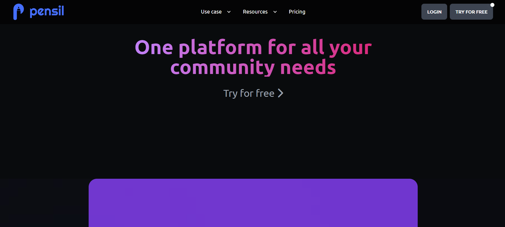

<!-- Intro -->
# All About Pensil

<!-- PROJECT LOGO -->
 

    
<h1 align="center">Pensil Community Landing Page</h1>

 
 

## Live Project

This project is presently deployed in **Vercel Service**.

[Live Link]()

---

 

<!-- Discription -->
## Discription

This Community Landing page is allows users to join the groups and grow their community. User can login and start their network. The major portion of my time was spent working on `HTML` and `Tailwind CSS` part. And most of the time is Required For `Mobile Responsive` and `animation`.
 

---

 

<!-- ABOUT THE PROJECT -->

## About The Project

Here's a Screen-Shot of my Project on the Pensil Community Landing Page I learned Most of my useful Future of HTML and Tailwind CSS.

---
 
## Built With

**Using Technologies :**

1. HTML
2. CSS
3. Tailwind CSS

---
 

## Completion Time of Project
For this project, I took around `6 to 8 days` to complete it. 

---

 

Project Link: [GitHub](https://github.com/vandit-bera/Pensil-Community-Landing-Page)

